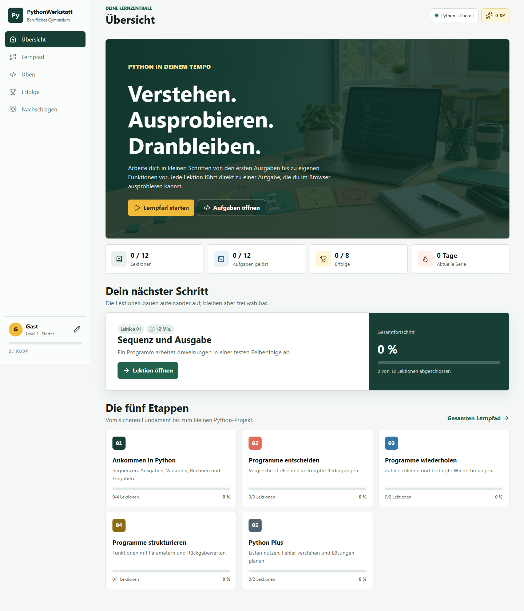
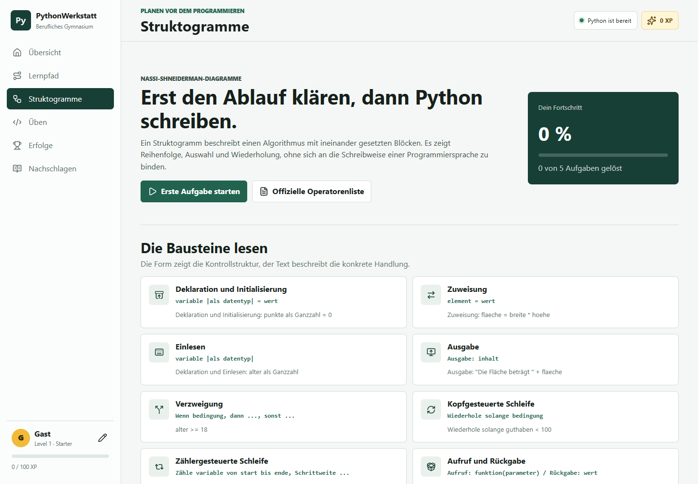

# PythonWerkstatt BG

Eine browserbasierte Lernumgebung für Schülerinnen und Schüler des beruflichen Gymnasiums. Das Portal führt in kleinen Schritten durch die Grundlagen der Programmierung mit Python und verbindet Erklärungen direkt mit ausführbaren Aufgaben.



## Enthalten

- 12 Lektionen vom ersten `print()` bis zu Funktionen, Listen und Fehlersuche
- 12 automatisch prüfbare Programmieraufgaben
- Struktogramm-Labor mit fünf Grundformen und fünf geprüften Übungen
- echter Python-Interpreter im Browser über Pyodide
- XP, Level, Lernfortschritt und acht Erfolge
- lokales Lernprofil ohne Server und ohne Übertragung personenbezogener Daten
- responsive Oberfläche für Computer, Tablet und Smartphone

## Lokal starten

Wegen des Web Workers muss die Seite über einen lokalen Webserver geöffnet werden:

```powershell
python -m http.server 4173
```

Danach `http://localhost:4173` öffnen.

## Technik

Das Projekt ist bewusst ohne Build-Schritt aufgebaut:

- `index.html` enthält die feste App-Struktur.
- `styles.css` enthält Layout und responsive Darstellung.
- `content.js` enthält Lektionen, Aufgaben und Erfolge.
- `app.js` steuert Navigation, Lernstand, Auswertung und UI.
- `python-worker.js` führt Python isoliert in einem Web Worker aus.



Der Lernstand wird ausschließlich im `localStorage` des verwendeten Browsers gespeichert.

## Dokumentation

- [Übergabe für die Weiterarbeit](UEBERGABE_Codex.md)
- [Didaktik, Datenschutz und Quellen](docs/TECHNIK_UND_DIDAKTIK.md)
- [Abgleich mit BPE 5, Materialstand 31.07.2025](docs/BPE5_ABGLEICH_2025.md)

## Fachliche Grundlage

Maßgeblich sind die Materialien des Landesbildungsservers Baden-Württemberg für
die nichtgewerblichen beruflichen Gymnasien, Jahrgangsstufe 1:
[Grundlagen der Programmierung – Version mit Python, Stand 31.07.2025](https://www.schule-bw.de/resolveuid/4bf04e3081af47f9aa0a7455778f3cbe).

Die vollständige Materialsammlung einschließlich Musterlösungen bleibt in der
privaten Unterrichtsablage und ist nicht Bestandteil dieses öffentlichen
Repositories.
